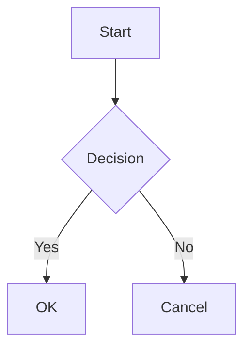

# Markdown Support

Velt includes a built-in markdown preview with live rendering, syntax highlighting, math formulas, diagrams, and customizable admonitions.

## Supported File Types

The markdown toolbar and preview features are available for files with these extensions:
- `.md`
- `.markdown`
- `.mdx`

## Activating the Markdown Toolbar

When a markdown file is open, a **Markdown toggle button** appears in the **status bar** (bottom-left). Click it to show or hide the markdown formatting toolbar.

The toolbar provides quick-access buttons for common formatting:
- **Bold**, **Italic**, **Strikethrough**
- Headings (H1-H3)
- Links, images
- Code (inline and blocks)
- Lists (bullet, numbered, task)
- Blockquotes
- Horizontal rules

The toolbar is independent of the preview — you can use it while editing without opening the preview panel.

## Opening the Preview

To open a live preview of your markdown file:

1. Open a `.md` file
2. Click the **eye icon** on the tab to toggle the preview

The preview opens in the **right pane** as a separate tab. Both panes are fully independent — you can have multiple tabs in each pane, resize them by dragging the divider, and the preview updates live as you type.

## Syntax

### Standard Markdown

All standard markdown syntax is supported:

```markdown
# Heading 1
## Heading 2

**bold** and *italic* and ~~strikethrough~~

- Bullet list
- Another item

1. Numbered list
2. Second item

- [x] Task list
- [ ] Incomplete task

[Link text](https://example.com)


> Blockquote

---

| Column 1 | Column 2 |
|----------|----------|
| Cell 1   | Cell 2   |
```

### Code Blocks

Fenced code blocks with syntax highlighting for 15+ languages:

````markdown
```javascript
function hello() {
  console.log("Hello, world!");
}
```

```python
def hello():
    print("Hello, world!")
```

```rust
fn main() {
    println!("Hello, world!");
}
```
````

Supported languages: JavaScript, TypeScript, Python, Rust, C, C++, Java, Go, CSS, HTML/XML, Bash, JSON, YAML, SQL, Markdown.

### Math (KaTeX)

Inline math with single dollars and display math with double dollars:

```markdown
Inline: $E = mc^2$

Display:
$$
\int_{-\infty}^{\infty} e^{-x^2} dx = \sqrt{\pi}
$$
```

### Diagrams (Mermaid)

Mermaid diagrams are rendered automatically:

````markdown

````

Mermaid is **lazy-loaded** — it's only downloaded when a diagram is first encountered, keeping the app lightweight.

### Admonitions

Admonitions (callout boxes) use the `:::` container syntax:

```markdown
::: info
This is an informational note.
:::

::: warning Watch Out
This is a warning with a custom title.
:::

::: danger
Critical information here.
:::

::: tip
A helpful tip.
:::

::: note
A general note.
:::
```

#### Built-in Types

| Type | Icon | Color | Use case |
|------|------|-------|----------|
| `info` | ℹ️ | Blue | General information |
| `warning` | ⚠️ | Amber | Caution notices |
| `danger` | 🔴 | Red | Critical warnings |
| `tip` | 💡 | Green | Helpful suggestions |
| `note` | 📝 | Gray | Side notes |

#### Custom Title

Add a title after the type name:

```markdown
::: warning Security Notice
Never commit API keys to version control.
:::
```

If no title is specified, the type name is capitalized (e.g., `warning` becomes `Warning`).

#### Custom Admonition Types

You can define your own admonition types in your [theme file](THEMES.md#custom-admonition-types). For example, after adding a `"success"` type to your theme:

```markdown
::: success Deployment Complete
Your application has been deployed to production.
:::
```

See [Theme System - Custom Admonitions](THEMES.md#custom-admonition-types) for configuration details.

## Preview Theming

The markdown preview appearance is fully customizable via the theme system. You can control colors for every element: headings, links, code blocks, tables, admonitions, and more.

See [Theme System - Markdown Preview](THEMES.md#markdownpreview-optional) for the complete list of properties.

## Split Pane

The markdown preview uses Velt's split pane system:

- The preview opens in the **right pane**
- **Drag the divider** to resize panes (20%-80% range)
- **Double-click the divider** to reset to 50/50
- Each pane has its own tab bar and manages tabs independently
- Closing the preview tab collapses the right pane if it was the last tab
- The status bar always reflects the **focused pane**
